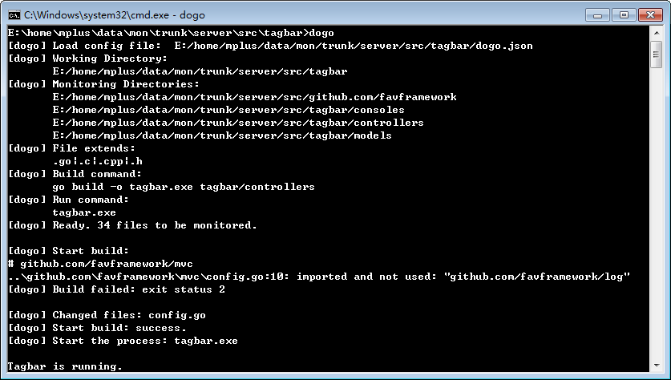

# dogo

[](https://travis-ci.org/liudng/dogo)
[](http://gocover.io/github.com/liudng/dogo)
[](https://github.com/liudng/dogo/blob/master/LICENSE)

Monitoring changes in the source file and automatically compile and run (restart).

[中文](doc/zh/README.md)

## Install

```bash
go get github.com/liudng/dogo
```

## Create config

Here are config file sample, save file as **dogo.json**:

```json
{
    "WorkingDir": "{GOPATH}/src/github.com/liudng/dogo/example",
    "SourceDir": [
        "{GOPATH}/src/github.com/liudng/dogo/example"
    ],
    "SourceExt": ".go|.c|.cpp|.h",
    "BuildCmd": "go build github.com/liudng/dogo/example",
    "RunCmd": "example.exe",
    "Decreasing": 1
}
```

**WorkingDir**: working directory, dogo will auto change to this directory.

**SourceDir**: the list of source directories.

**SourceExt**: monitoring file type.

**BuildCmd**: the command of build and compile.

**RunCmd**: the program (full) path.

**Decreasing**: Ignore the number of modifies, after build.

## Start monitoring

type the command to start:

```sh
dogo
```

or, specify config file with -c

```sh
dogo -c=/path/to/dogo.json
```

the path can contain {GOPATH}.

## screen capture

